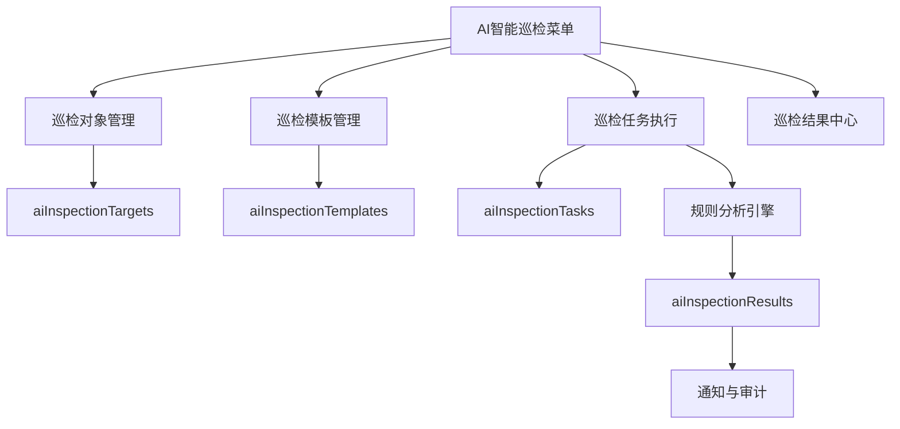

# AI智能巡检

Feature Name: ai-smart-inspection
Updated: 2026-06-20

## Description

在现有驻场运维管理系统中新增“AI智能巡检”一级菜单。第一版覆盖服务器、网络设备、安全设备三类对象，支持巡检对象接入信息管理、模板管理、任务创建与执行、结果分析与通知。分析引擎采用本地规则计算与文本生成策略，先实现稳定可解释的智能巡检闭环。

## Architecture



前端继续使用 `public/index.html` 单页结构，后端继续在 `server.js` 中增加 REST 接口和规则分析函数，数据继续存放到统一状态仓库。

## Components and Interfaces

### 1. 主导航与页面分区
- 在主导航增加 `data-tab="aiInspection"`。
- 增加四个子页：巡检对象、巡检模板、巡检任务、巡检结果。
- 复用现有分页、表单、项目过滤和角色权限模式。

### 2. 数据模型
- `aiInspectionTargets`
  - `id`
  - `projectId`
  - `assetId`
  - `name`
  - `category`
  - `address`
  - `protocol`
  - `port`
  - `authType`
  - `account`
  - `systemVersion`
  - `location`
  - `notes`
  - `createdBy`
  - `createdAt`
- `aiInspectionTemplates`
  - `id`
  - `projectId`
  - `name`
  - `category`
  - `description`
  - `metrics`
  - `createdBy`
  - `createdAt`
- `aiInspectionTasks`
  - `id`
  - `projectId`
  - `targetId`
  - `templateId`
  - `title`
  - `executor`
  - `executedAt`
  - `metrics`
  - `status`
  - `createdBy`
  - `createdAt`
- `aiInspectionResults`
  - `id`
  - `projectId`
  - `taskId`
  - `targetId`
  - `templateId`
  - `score`
  - `level`
  - `summary`
  - `risk`
  - `suggestion`
  - `abnormalItems`
  - `createdAt`

### 3. 后端接口
- `GET /api/ai-inspection/targets`
- `POST /api/ai-inspection/targets`
- `DELETE /api/ai-inspection/targets/:id`
- `GET /api/ai-inspection/templates`
- `POST /api/ai-inspection/templates`
- `DELETE /api/ai-inspection/templates/:id`
- `GET /api/ai-inspection/tasks`
- `POST /api/ai-inspection/tasks`
- `DELETE /api/ai-inspection/tasks/:id`
- `GET /api/ai-inspection/results`
- `GET /api/ai-inspection/results/:id`

### 4. 规则分析引擎
- 输入：模板指标定义和任务录入的指标值。
- 输出：健康评分、状态等级、异常项、结论、风险、建议。
- 等级规则：
  - 存在严重指标 -> `严重`
  - 存在告警指标且无严重指标 -> `异常`
  - 存在轻微超标或缺失值 -> `关注`
  - 全部正常 -> `正常`
- 分数规则：初始 100 分，轻微异常扣 10 分，告警扣 20 分，严重扣 35 分，最低 0 分。

## Data Models

### 模板指标结构

```json
{
  "key": "cpuUsage",
  "label": "CPU使用率",
  "unit": "%",
  "warn": 70,
  "critical": 90,
  "direction": "high",
  "description": "持续高负载可能影响设备稳定性"
}
```

### 第一版默认指标
- 服务器：CPU、内存、磁盘、磁盘 inode、系统负载、关键服务状态。
- 网络设备：CPU、内存、接口异常数、丢包率、CRC 错误数、主备状态。
- 安全设备：CPU、内存、会话使用率、策略命中异常数、特征库版本天数、授权剩余天数。

## Correctness Properties

- 巡检对象的项目归属必须与关联资产一致。
- 任务必须引用存在的巡检对象和模板。
- 结果必须由任务自动生成，结果与任务一一对应。
- 非管理员用户只能操作本项目数据。
- 客户角色拥有查看权限，不拥有写权限。

## Error Handling

- 巡检对象缺少名称、类别或地址时返回表单错误。
- 模板指标为空时拒绝保存。
- 任务引用不存在对象或模板时返回 404/400。
- 指标值无法解析为数字时返回校验错误。
- 任务生成异常结果时创建通知提醒。

## Test Strategy

- 后端接口测试：对象、模板、任务、结果的创建、查询、删除与权限校验。
- 规则分析测试：正常、关注、异常、严重四种等级分支。
- 前端冒烟测试：菜单切换、表单提交、分页渲染、结果联动。
- 回归测试：将 AI智能巡检接口加入 `loadBaseData` 和 `regression` 链路。

## References

[^1]: `server.js:164` - 统一数据模型标准化入口
[^2]: `server.js:1881` - 现有巡检管理接口模式
[^3]: `public/index.html:866` - 深化运维页面布局模式
[^4]: `public/index.html:2475` - 基础数据加载入口
