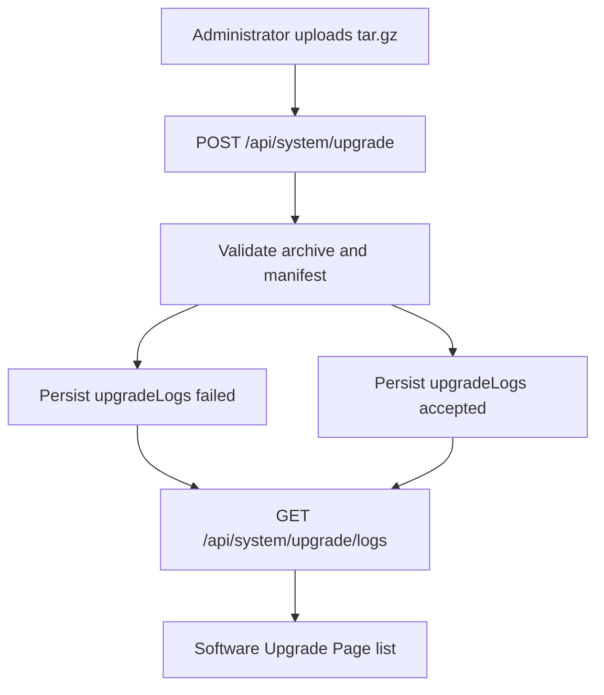

# Software Upgrade Logs

Feature Name: software-upgrade-logs
Updated: 2026-09-13

## Description

在软件升级卡片内展示升级尝试历史。服务端在接收或拒绝升级包时写入 `upgradeLogs`，管理员通过 `GET /api/system/upgrade/logs` 拉取最近记录。

## Architecture



升级校验与应用流程保持现有实现。本功能只增加持久化记录与页面列表。

## Components and Interfaces

- `server.js`
  - 集合 `upgradeLogs` 加入 `dbCollectionKeys` 与 `normalizeDb`
  - `appendUpgradeLog` 写入记录并截断至 200 条
  - `POST /api/system/upgrade` 在失败与接收成功时写日志
  - `GET /api/system/upgrade/logs` 仅管理员，返回按时间倒序的列表
- `public/index.html`
  - 软件升级卡片内 `#systemUpgradeLogList`
  - `refreshUpgradeLogs()` 在系统治理刷新与上传失败后调用

## Data Models

```text
upgradeLogs[]
  id            string
  operatorId    string
  operatorName  string
  filename      string
  fromVersion   string
  toVersion     string
  status        accepted | failed
  message       string
  createdAt     string
```

MySQL 表名：`col_upgrade_logs`。

## Correctness Properties

- 仅 `admin` 可读取 Upgrade Logs
- 失败路径在返回 400 前完成持久化
- 页面输出使用 `esc` 转义
- 文件名只保留 basename，最长 180 字符

## Error Handling

- 升级包非法路径、解压失败、符号链接、缺文件、SHA256/签名失败：status=`failed`，message 为接口错误文案
- 日志接口未授权：403
- 集合为空：页面显示「暂无升级日志」

## Test Strategy

- regression：管理员上传损坏升级包后，`GET /api/system/upgrade/logs` 含 `failed` 记录
- regression：工程师访问该接口返回 403
- lint / typecheck 通过

## References

[^1]: (Filename) - [Upgrade POST handler](server.js)
[^2]: (Filename) - [Software upgrade card](public/index.html)
