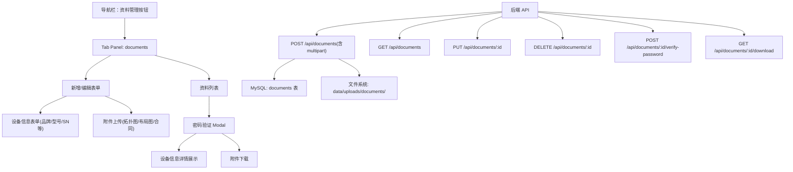

# 资料管理

Feature Name: document-management
Updated: 2026-07-08

## 描述

新增"资料管理"一级菜单模块，用于集中管理驻场运维项目中的敏感技术资料（设备管理信息、网络拓扑图、设备位置布局图、项目合同）。每条资料设置独立访问密码，查看/下载前需通过密码验证。

## 架构



## 组件与接口

### 前端组件

| 组件 | 位置 | 说明 |
|------|------|------|
| 导航按钮 | `#navTabs` 内 `<button data-tab="documents">` | 位于 AI智能巡检 之后 |
| tab-panel | `<section class="tab-panel hidden" data-tab="documents">` | 包含 form 和 list 两个 subtab |
| 资料类型选择 | `<select name="type">` | 设备管理信息/网络拓扑图/布局图/合同 |
| 表单字段（设备信息） | `#documentForm` 内各字段 | 品牌/型号/SN/购买日期/过保日期/管理方式/IP/账号/密码 |
| 附件上传控件 | `<input type="file" name="attachment">` | 类型为非设备信息时显示 |
| 资料列表 | `#documentTable` | 分页表格，含全选/项目筛选/类型筛选/搜索 |
| 密码验证 Modal | `#documentPasswordModal` | 输入框+确认/取消按钮，3次错误锁定5分钟 |
| 编辑 Modal | `#documentEditModal` | 复用表单模式的弹窗 |

### 后端接口

| 方法 | 路径 | 权限 | 说明 |
|------|------|------|------|
| GET | `/api/documents` | 已登录 | 列表查询，支持 projectId/type/keyword/page/pageSize |
| POST | `/api/documents` | admin/engineer | 新增资料，multipart 上传附件 |
| GET | `/api/documents/:id` | 已登录 | 获取单条详情（不含密码） |
| PUT | `/api/documents/:id` | admin/engineer | 修改资料，可替换附件 |
| DELETE | `/api/documents/:id` | admin/engineer | 删除资料及关联附件 |
| POST | `/api/documents/:id/verify-password` | 已登录 | 验证访问密码，返回临时下载令牌 |
| GET | `/api/documents/:id/download?token=xxx` | 已登录 | 通过令牌下载附件 |

### 接口详细设计

#### POST /api/documents (multipart)

```
Content-Type: multipart/form-data

Fields:
  projectId:  string (必填)
  type:       string (必填: device/topology/layout/contract)
  title:      string (必填)
  brand:      string (type=device时)
  model:      string (type=device时)
  serialNumber: string (type=device时)
  purchaseDate: string (type=device时)
  warrantyExpiryDate: string (type=device时)
  managementMethod: string (type=device时)
  managementIp: string (type=device时)
  loginAccount: string (type=device时)
  loginPassword: string (type=device时, 明文存储前scrypt哈希)
  accessPassword: string (必填, scrypt哈希存储)
  attachment: file (type非device时必填)

Response 201: { id, type, title, ... }
```

#### POST /api/documents/:id/verify-password

```
Body JSON: { password: "用户输入的密码" }

Response 200: { ok: true, token: "临时下载令牌" }
Response 401: { message: "密码错误，剩余尝试次数 X" }
Response 429: { message: "密码验证过于频繁，请 X 分钟后重试" }
```

## 数据模型

### documents 表 (MySQL / db.json)

```javascript
{
  id: "doc_a1b2c3d4e5f6",     // 唯一标识
  projectId: "project_xxx",     // 关联项目ID
  type: "device",               // device | topology | layout | contract
  title: "核心交换机",           // 资料名称
  
  // 设备信息字段 (type=device 时)
  brand: "华为",
  model: "CE12800",
  serialNumber: "SN-2026-001",
  purchaseDate: "2026-01-15",
  warrantyExpiryDate: "2027-01-15",
  managementMethod: "SSH",
  managementIp: "192.168.1.1",
  loginAccount: "admin",
  loginPasswordHash: "$scrypt$...",  // scrypt 哈希
  
  // 附件信息 (type非device时)
  attachmentName: "拓扑图.png",      // 原始文件名
  attachmentPath: "doc_a1b2/xxx",    // 服务器存储路径
  attachmentSize: 204800,            // 文件大小(字节)
  
  // 通用字段
  accessPasswordHash: "$scrypt$...",  // 访问密码 scrypt 哈希
  createdBy: "user_xxx",             // 创建人ID
  createdAt: "2026-07-08T...",       // 创建时间
  updatedAt: "2026-07-08T..."        // 更新时间
}
```

### 密码验证速率限制 (runtimeState，不持久化到 documents)

```javascript
// 存储在 runtimeState.documentPasswordLimits 中
{
  key: "doc_ip_user",        // 文档ID + IP + 用户ID 组合键
  count: 2,                  // 失败次数
  firstAttemptAt: 1712345678000,
  lockedUntil: 0              // 锁定截止时间戳(ms)
}
```

## 正确性约束

- accessPasswordHash 使用 `crypto.scryptSync` + 随机盐，与用户密码哈希一致
- loginPasswordHash 同样使用 scrypt 哈希，仅存储哈希值
- 附件存储在 `data/uploads/documents/{docId}/` 目录下
- 删除资料时同步删除服务器上的附件文件
- 密码验证令牌使用 HMAC-SHA256 签名，有效期 10 分钟
- 密码连续错误 3 次锁定 5 分钟（按 文档ID + IP + 用户ID 维度）

## 错误处理

| 场景 | HTTP | 前端行为 |
|------|------|----------|
| 未登录访问资料API | 401 | 跳转登录页 |
| 非admin/engineer提交资料 | 403 | toast 提示"仅有管理员和运维可管理资料" |
| 必填字段为空 | 400 | 表单字段下方显示红色提示 |
| 附件类型资料未上传文件 | 400 | "请上传附件" |
| 密码错误 | 401 | "密码错误，剩余 X 次尝试" |
| 密码验证被锁定 | 429 | "密码验证过于频繁，请 X 分钟后重试" |
| 下载令牌无效或过期 | 403 | "访问链接已过期，请重新验证密码" |
| 附件文件不存在 | 404 | "附件文件不存在或已被删除" |

## 测试策略

- **lint / typecheck**: 修改后必须通过 `npm run lint` 和 `npm run typecheck`
- **regression**: 扩展 `scripts/regression.js`，新增资料 CRUD + 密码验证 + 附件上传下载的自动化断言
- **e2e**: 扩展 `scripts/e2e.js`，新增浏览器级资料管理流程测试
- **smoke**: 扩展 `scripts/smoke.js`，新增 GET /api/documents 基本读取验证

## 参考资料

[^1]: `/workspace/public/index.html#L1523` - 知识库 tab-panel 模式参考
[^2]: `/workspace/server.js#L3900` - 知识库 API 路由模式参考
[^3]: `/workspace/server.js#L3060` - parseMultipart 文件上传解析
[^4]: `/workspace/server.js#L78` - hash/verifyPassword 密码哈希
